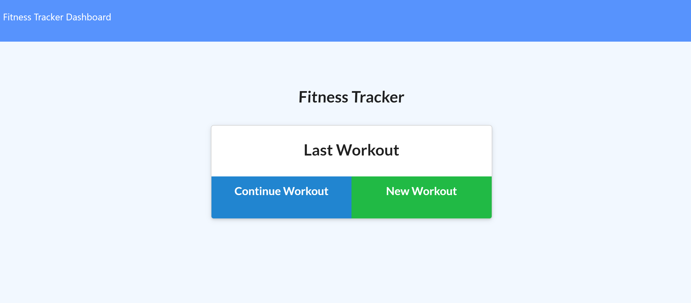

# Fitness Tracker - HW 17
https://github.com/stevenrsewell/Fitness-Tracker.git

This application is a MongoDB fitness tracker. The application should allow the user to add exercises to a previous workout, add new exercises to a workout, and generate a Stats page. Information is saved in the database and can be viewed later.

## User Story
As a user ... I want to be able to view create and track daily workouts ... So that I can visually see the effects of my workout plan.

## Dependencies Used
Node.js
Express
Mongo DB

## Screenshots
Below is the first page of what the completed application should look like 
</img>

